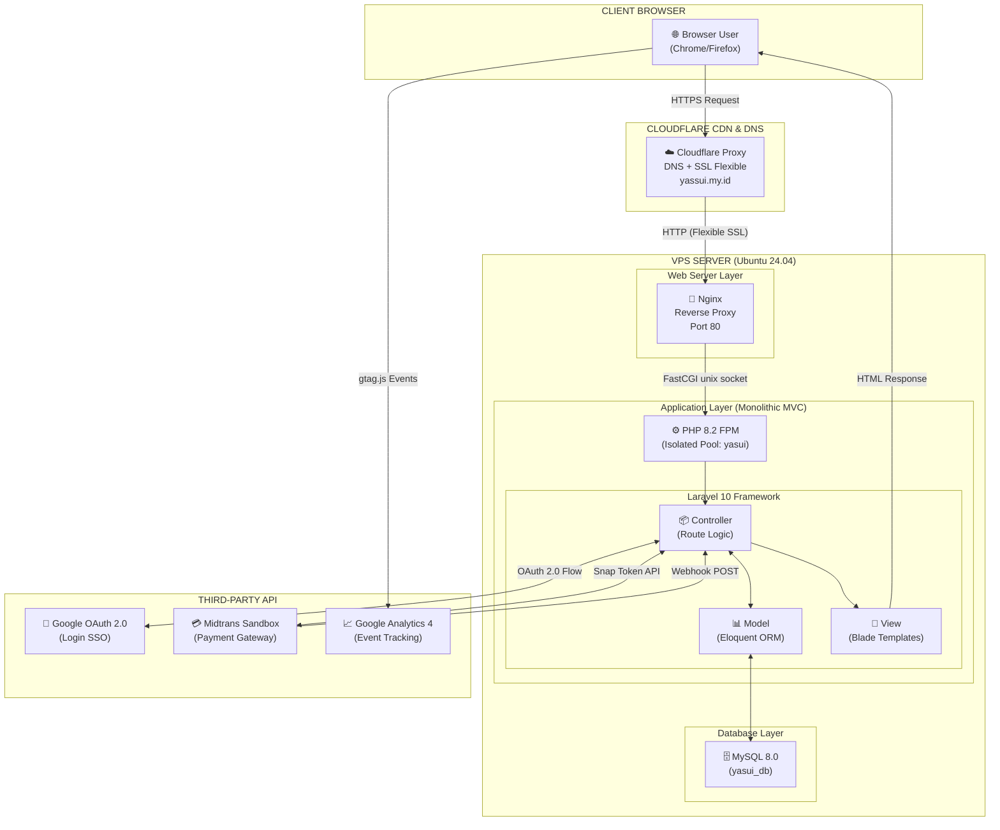
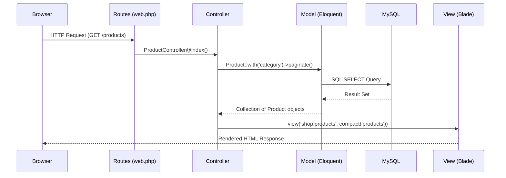
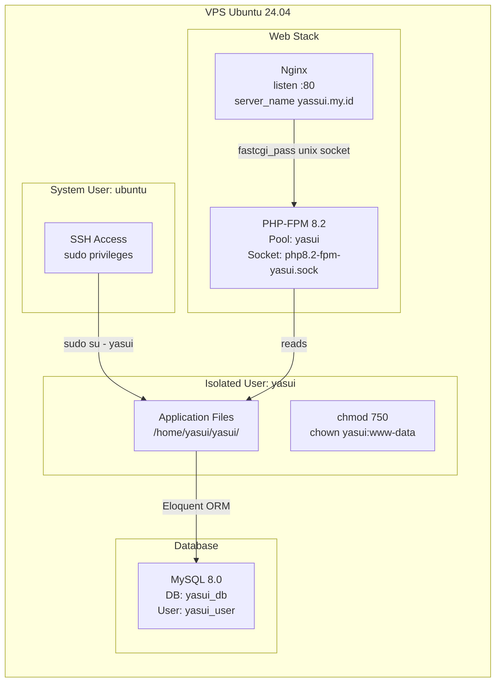
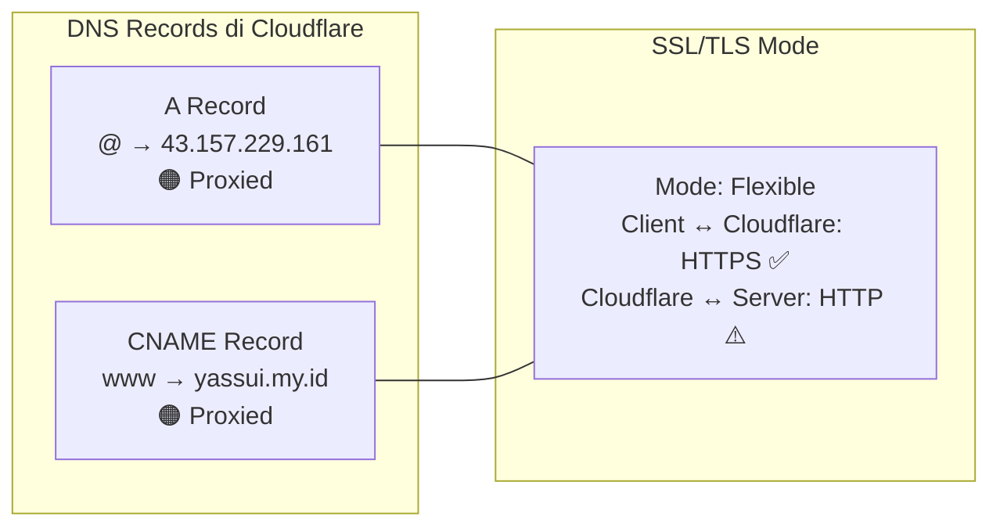
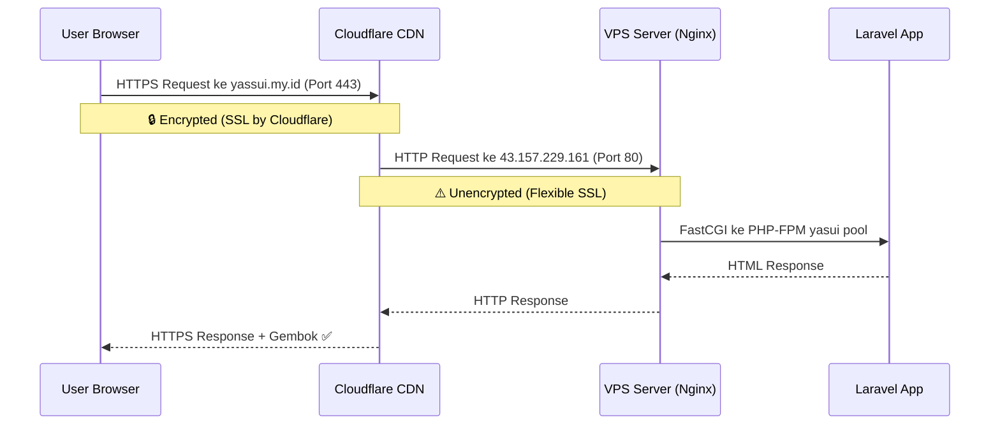
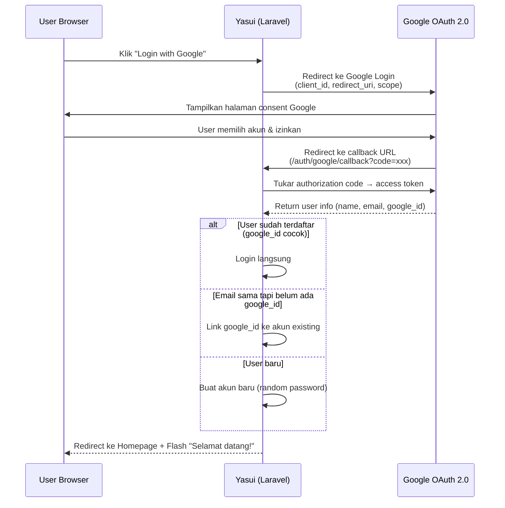
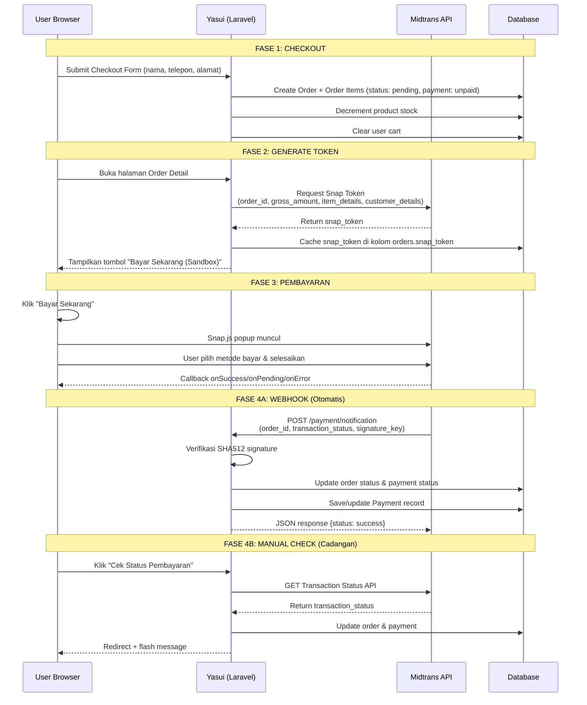
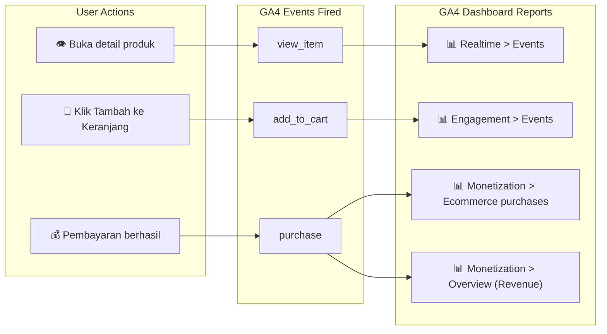
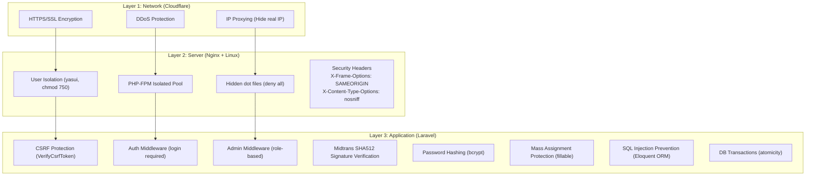

# 📚 DOKUMENTASI TEKNIS LENGKAP — YASUI E-COMMERCE

> **Proyek:** Yasui — Platform E-Commerce Merchandise Anime  
> **URL Produksi:** [https://yassui.my.id](https://yassui.my.id)  
> **Repository:** [github.com/aandrsta/yasui](https://github.com/aandrsta/yasui)  
> **Pengembang:** Solo Developer (One-Man Project)  
> **Tanggal Dokumentasi:** 24 Mei 2026

---

## Daftar Isi

1. [Arsitektur Sistem](#1-arsitektur-sistem)
2. [Tech Stack & Tools yang Digunakan](#2-tech-stack--tools-yang-digunakan)
3. [Struktur Database](#3-struktur-database)
4. [Development Phase (Riwayat Commit GitHub)](#4-development-phase-riwayat-commit-github)
5. [Deployment Phase (Setup VPS & Server)](#5-deployment-phase-setup-vps--server)
6. [Production Phase (Domain, DNS & Cloudflare)](#6-production-phase-domain-dns--cloudflare)
7. [Implementasi SSO OAuth Google](#7-implementasi-sso-oauth-google)
8. [Implementasi Payment Gateway Midtrans](#8-implementasi-payment-gateway-midtrans)
9. [Implementasi Data Analytics (Google Analytics 4)](#9-implementasi-data-analytics-google-analytics-4)
10. [Term of Service & Privacy Policy](#10-term-of-service--privacy-policy)
11. [Keamanan Sistem](#11-keamanan-sistem)
12. [Simulasi Pembelian Antar Kelompok](#12-simulasi-pembelian-antar-kelompok)
13. [Troubleshooting & Kendala](#13-troubleshooting--kendala)
14. [Rincian Biaya](#14-rincian-biaya)

---

## 1. Arsitektur Sistem

### 1.1 Jenis Arsitektur: Monolithic MVC (Model-View-Controller)



### 1.2 Mengapa Monolithic MVC?

Pemilihan arsitektur ini berdasarkan analisis kebutuhan dan constraint proyek:

| Faktor | Analisis | Kesimpulan |
|--------|----------|------------|
| **Jumlah Developer** | 1 orang (solo project) | Tidak butuh microservices yang memerlukan koordinasi tim besar |
| **Timeline** | 10 hari development | Monolithic jauh lebih cepat untuk dibangun dari nol |
| **Infrastruktur** | Single VPS (1 server) | Tidak ada kebutuhan horizontal scaling |
| **Kompleksitas** | E-commerce sederhana (CRUD + payment) | Tidak memerlukan pemisahan service per domain bisnis |
| **Skill Background** | PHP native | Laravel mempercepat development karena ekosistem mature |
| **Biaya** | Rp 0 (gratis semua) | Microservices butuh infra tambahan (message queue, container orchestration) |

> [!IMPORTANT]
> **Alasan Kunci:** Untuk proyek dengan 1 developer, timeline 10 hari, dan single VPS — arsitektur **Monolithic MVC** adalah pilihan paling pragmatis dan efisien. Arsitektur microservices akan menjadi *over-engineering* yang menambah kompleksitas tanpa memberikan manfaat nyata.

### 1.3 Pola Arsitektur MVC di Laravel



| Komponen MVC | Implementasi di Yasui | Lokasi File |
|---|---|---|
| **Model** | Eloquent ORM — 7 model relasional | [app/Models/](file:///c:/laragon/www/yasui/app/Models) |
| **View** | Blade Templates + Bootstrap 5 (SSR) | [resources/views/](file:///c:/laragon/www/yasui/resources/views) |
| **Controller** | 10 controller terorganisir dalam namespace | [app/Http/Controllers/](file:///c:/laragon/www/yasui/app/Http/Controllers) |
| **Routes** | Definisi single file `web.php` | [routes/web.php](file:///c:/laragon/www/yasui/routes/web.php) |
| **Middleware** | Auth + Admin role-based access control | [app/Http/Middleware/](file:///c:/laragon/www/yasui/app/Http/Middleware) |
| **Service** | MidtransService (logic payment) | [app/Services/MidtransService.php](file:///c:/laragon/www/yasui/app/Services/MidtransService.php) |

---

## 2. Tech Stack & Tools yang Digunakan

### 2.1 Stack Utama (Backend + Frontend)

| Layer | Teknologi | Versi | Fungsi |
|-------|-----------|-------|--------|
| **Framework** | Laravel | 10.x | Backend MVC framework utama |
| **Bahasa** | PHP | 8.1+ (8.2 di VPS) | Server-side language |
| **Frontend** | Blade + Bootstrap | 5.3.2 | Server-Side Rendering (SSR) + UI framework |
| **Database** | MySQL | 8.0 | Relational database |
| **Build Tool** | Vite | (via Laravel) | Asset bundling CSS/JS untuk production |
| **Font** | Google Fonts Inter | wght@300-800 | Tipografi modern dan profesional |
| **Icons** | Bootstrap Icons | 1.11.2 | Ikon UI yang konsisten |

### 2.2 Package Laravel (Dependencies)

| Package Composer | Fungsi |
|------------------|--------|
| `laravel/socialite` ^5.27 | OAuth 2.0 untuk login via Google SSO |
| `midtrans/midtrans-php` ^2.6 | Library resmi Midtrans untuk payment gateway |
| `laravel/sanctum` ^3.3 | API token authentication (bawaan Laravel) |
| `filament/filament` ^3.3 | Admin panel framework (terpasang tapi tidak aktif digunakan) |
| `hardevine/shoppingcart` ^3.4 | Shopping cart helper (terpasang, cart menggunakan DB model langsung) |
| `intervention/image` ^3.11 | Image processing (terpasang sebagai dependency) |
| `guzzlehttp/guzzle` ^7.2 | HTTP client untuk komunikasi API (Socialite & Midtrans) |

### 2.3 Tools Infrastruktur & Eksternal

| Kategori | Tool / Service | Fungsi |
|----------|----------------|--------|
| **Local Dev** | Laragon (Windows) | Web server + database lokal |
| **VPS** | Ubuntu 24.04 LTS (dari Dosen) | Production server |
| **Web Server** | Nginx | Reverse proxy & static file serving |
| **PHP Runtime** | PHP-FPM 8.2 (isolated pool) | Process manager PHP terisolasi per user |
| **Version Control** | Git + GitHub | Source code management & collaboration |
| **DNS** | Cloudflare | DNS management + CDN |
| **SSL/HTTPS** | Cloudflare Flexible SSL | HTTPS termination tanpa SSL di server |
| **Domain** | yassui.my.id | Domain murah Indonesia (.my.id) |
| **OAuth** | Google Cloud Console | OAuth 2.0 credential management |
| **Payment** | Midtrans Sandbox | Simulasi pembayaran (non-produksi) |
| **Analytics** | Google Analytics 4 | User behavior & e-commerce tracking |
| **Package Manager** | Composer (PHP) + npm (JS) | Dependency management |

---

## 3. Struktur Database

### 3.1 Entity Relationship Diagram (ERD)

```mermaid
erDiagram
    users ||--o{ orders : "menempatkan"
    users ||--o{ carts : "memiliki"
    categories ||--o{ products : "memiliki"
    products ||--o{ carts : "ditambahkan ke"
    products ||--o{ order_items : "dipesan pada"
    orders ||--o{ order_items : "berisi"
    orders ||--o| payments : "dibayar via"

    users {
        bigint id PK
        string name
        string email UK
        string password
        string google_id "nullable - untuk SSO"
        enum role "admin | user"
        string phone "nullable"
        text address "nullable"
        timestamp email_verified_at "nullable"
        timestamps created_at
    }

    categories {
        bigint id PK
        string name
        string slug UK
        text description "nullable"
        string image "nullable"
        timestamps created_at
    }

    products {
        bigint id PK
        bigint category_id FK
        string name
        string slug UK
        text description
        decimal price "15,2"
        int stock "default 0"
        string image "nullable"
        boolean is_featured "default false"
        timestamps created_at
    }

    carts {
        bigint id PK
        bigint user_id FK
        bigint product_id FK
        int quantity "default 1"
        timestamps created_at
    }

    orders {
        bigint id PK
        bigint user_id FK
        string order_number UK "ORD-XXXXXXXXXX"
        decimal total_price "15,2"
        enum status "pending|processing|shipped|completed|cancelled"
        enum payment_status "unpaid|paid|failed"
        string snap_token "nullable - Midtrans token"
        string shipping_name
        text shipping_address
        string shipping_phone
        timestamps created_at
    }

    order_items {
        bigint id PK
        bigint order_id FK
        bigint product_id FK
        string product_name "snapshot nama produk"
        int quantity
        decimal price "15,2 - snapshot harga"
        timestamps created_at
    }

    payments {
        bigint id PK
        bigint order_id FK
        string transaction_id "nullable - dari Midtrans"
        string payment_type "nullable - credit_card|gopay|dll"
        decimal amount "15,2"
        string status "pending|paid|failed"
        json raw_response "nullable - response mentah Midtrans"
        timestamps created_at
    }
```



### 3.2 Ringkasan Tabel

| Tabel | Jumlah Kolom | Relasi Utama | Keterangan |
|-------|-------------|--------------|------------|
| `users` | 10 | hasMany → orders, carts | Menyimpan user reguler dan admin |
| `categories` | 6 | hasMany → products | 4 kategori: Figures, Model Kits, Character Goods, Plushies |
| `products` | 10 | belongsTo → category | 12 produk seeder anime merchandise |
| `carts` | 5 | belongsTo → user, product | Keranjang belanja berbasis database |
| `orders` | 11 | hasMany → order_items, hasOne → payment | Mencatat pesanan + snap_token Midtrans |
| `order_items` | 7 | belongsTo → order, product | Snapshot barang yang dibeli (harga saat beli) |
| `payments` | 8 | belongsTo → order | Rekaman pembayaran dari Midtrans |

### 3.3 Data Seeder

| Seeder | Data yang Dibuat |
|--------|-----------------|
| `CategorySeeder` | 4 kategori: Figures, Model Kits, Character Goods, Plushies |
| `ProductSeeder` | 12 produk anime merchandise (harga Rp 95.000 – Rp 2.450.000) |
| `UserSeeder` | 1 admin (`admin@yasui.com` / `admin123`) + 3 user test |

---

## 4. Development Phase (Riwayat Commit GitHub)

Seluruh pengembangan dilakukan secara bertahap dalam **8 fase** dengan total **18 commits** di repository GitHub [aandrsta/yasui](https://github.com/aandrsta/yasui). Berikut adalah kronologi lengkap berdasarkan git log:

### 4.1 Tabel Riwayat Commit

| # | Commit Hash | Pesan Commit | Fase |
|---|-------------|-------------|------|
| 1 | `92ea75d` | `feat: initialize project structure, database migrations, models and seeders (phase 1)` | Phase 1 |
| 2 | `ba5c64e` | `feat: implement clean minimalist layout, standard auth and working google sso (phase 2)` | Phase 2 |
| 3 | `22c7787` | `feat: implement Phase 3 - Product Catalog with Japanese Anime niche and theme alignment` | Phase 3 |
| 4 | `8a2fe02` | Merge PR #1 `feat/phase-3-product-catalog` | Phase 3 |
| 5 | `779414d` | `style: center and stack catalog pagination layout` | Phase 3 |
| 6 | `206425b` | Merge PR #2 `feat/phase-3-product-catalog` | Phase 3 |
| 7 | `77e06b5` | `feat: implement Phase 4 - DB-backed Cart and Checkout flow with stock validation and DB transactions` | Phase 4 |
| 8 | `6ca0d34` | Merge PR #3 `feat/phase-4-cart-checkout` | Phase 4 |
| 9 | `17d20b1` | `feat: implement Phase 5 - Midtrans Sandbox payment integration with local webhook simulator` | Phase 5 |
| 10 | `91f700b` | `fix: import Str helper in PaymentController to fix local simulation crash` | Phase 5 |
| 11 | `ae5ea16` | `feat(payment): implement hybrid payment notification and status polling for local and production` | Phase 5 |
| 12 | `199e594` | Merge PR #4 `feat/phase-5-midtrans-payment` | Phase 5 |
| 13 | `ba7e614` | `feat(admin): implement simple admin panel and user order history index` | Phase 6 |
| 14 | `b6709cc` | Merge PR #5 `feat/phase-5-midtrans-payment` | Phase 6 |
| 15 | `0ffc9ef` | `feat(analytics): implement GA4 e-commerce tracking and static legal pages` | Phase 7 |
| 16 | `30b997f` | Merge PR #6 `feat/phase-5-midtrans-payment` | Phase 7 |
| 17 | `063c4bc` | `fix: paksa HTTPS di production untuk Cloudflare proxy` | Phase 8 |
| 18 | `63a1fd0` | `fix: GA4 doesnt work but now idk` | Phase 8 |

### 4.2 Detail Per Fase

#### 📦 Phase 1 — Setup, Database, Models & Seeders
**Commit:** `92ea75d`

Yang dikerjakan:
- Install Laravel 10 via Composer
- Install package: `laravel/socialite`, `midtrans/midtrans-php`
- Konfigurasi `.env`, `config/services.php`, `config/midtrans.php`
- Buat 10 migration file (7 tabel utama + 3 bawaan Laravel)
- Buat 7 Eloquent Model dengan relasi (User, Product, Category, Cart, Order, OrderItem, Payment)
- Buat 3 seeder: CategorySeeder (4 kategori), ProductSeeder (12 produk), UserSeeder (1 admin + 3 user)

#### 🎨 Phase 2 — Layout, Auth & Google SSO
**Commit:** `ba5c64e`

Yang dikerjakan:
- Master layout Blade (`layouts/app.blade.php`) dengan Bootstrap 5.3
- Design system: CSS custom properties, tipografi Inter, color palette minimalis
- Navbar responsif dengan cart badge dan user dropdown
- Auth manual: RegisterController, LoginController (email/password)
- **Google OAuth SSO**: GoogleController via Laravel Socialite
- Tombol "Login with Google" di halaman login
- Bypass SSL verification Socialite untuk environment local (Laragon/Windows cURL issue)

#### 🛍️ Phase 3 — Product Catalog
**Commits:** `22c7787`, `779414d`

Yang dikerjakan:
- Homepage: hero section, kategori cards, featured products grid
- Product listing: search query, filter kategori, pagination Bootstrap 5
- Product detail: gambar, deskripsi, stok indicator, tombol add to cart
- Related products section berdasarkan kategori yang sama
- Niche branding: Japanese anime merchandise theme

#### 🛒 Phase 4 — Cart & Checkout
**Commit:** `77e06b5`

Yang dikerjakan:
- CartController: add, update quantity, remove — berbasis database (bukan session)
- Cart badge real-time di navbar (hitung total quantity)
- Checkout page: form shipping (nama, telepon, alamat)
- Double-check stock sebelum create order
- Order creation dalam DB Transaction (atomicity)
- Auto-decrement product stock + auto-clear cart setelah order dibuat

#### 💳 Phase 5 — Midtrans Payment
**Commits:** `17d20b1`, `91f700b`, `ae5ea16`

Yang dikerjakan:
- MidtransService: generate Snap Token dengan item details, customer details, expiry 24 jam
- Halaman Order Detail: tombol "Bayar Sekarang (Sandbox)" — Snap.js popup
- Webhook handler: `POST /payment/notification` — menerima notifikasi otomatis dari Midtrans
- SHA512 signature verification untuk keamanan webhook
- Hybrid approach: webhook + manual status polling via Midtrans API
- Passive background sync: auto-check status saat user membuka halaman order
- Stock revert otomatis saat pembayaran gagal/expired/cancelled

#### 📊 Phase 6 — Admin Panel & Order History
**Commit:** `ba7e614`

Yang dikerjakan:
- Admin dashboard: total revenue, total orders, total customers, total products
- Admin CRUD produk: create, edit, delete dengan image upload
- Admin manage orders: list semua pesanan + update status (pending → processing → shipped → completed → cancelled)
- User order history: daftar pesanan + detail per order
- AdminMiddleware: role-based access control (hanya `role === 'admin'`)

#### 📈 Phase 7 — GA4 Analytics & Legal Pages
**Commit:** `0ffc9ef`

Yang dikerjakan:
- Google Analytics 4 script di master layout (conditional loading)
- 3 GA4 E-Commerce Events: `view_item`, `add_to_cart`, `purchase`
- Terms of Service page (`/terms-of-service`)
- Privacy Policy page (`/privacy-policy`)
- Link kebijakan di footer website

#### 🔧 Phase 8 — Production Fixes
**Commits:** `063c4bc`, `63a1fd0`

Yang dikerjakan:
- Force HTTPS di production melalui `AppServiceProvider` (untuk Cloudflare proxy)
- Fix GA4 tracking yang tidak berfungsi di production
- Bug fixing dan polishing final

---

## 5. Deployment Phase (Setup VPS & Server)

### 5.1 Informasi Server

| Parameter | Nilai |
|-----------|-------|
| **Provider VPS** | VPS Dosen (shared, gratis) |
| **OS** | Ubuntu 24.04 LTS |
| **Public IP** | `43.157.229.161` |
| **Akses** | SSH (`ssh ubuntu@43.157.229.161`) |
| **Application Path** | `/home/yasui/yasui/` |
| **Web Port (Fase 1)** | `8001` (terisolasi) |
| **Web Port (Fase 2)** | `80` (standard HTTP) |

### 5.2 Arsitektur Server (Deployment)



### 5.3 Proses Setup Otomatis (setup.sh)

Deployment dilakukan menggunakan script otomasi [setup.sh](file:///c:/laragon/www/yasui/setup.sh) yang mencakup 9 langkah:

| Step | Aksi | Detail |
|------|------|--------|
| 1/9 | Update system | `apt update && apt upgrade -y` |
| 2/9 | Install utilities | git, curl, unzip, zip, ca-certificates |
| 3/9 | Install PHP 8.2 + Extensions | php8.2-fpm, mysql, mbstring, xml, bcmath, curl, zip, gd, cli, intl, sqlite3 (via PPA ondrej/php) |
| 4/9 | Install Nginx & MySQL | Web server + database server |
| 5/9 | Create isolated user `yasui` | `adduser --disabled-password`, `chmod 750 /home/yasui`, `chown yasui:www-data` |
| 6/9 | Configure PHP-FPM pool | Pool terpisah `[yasui]` dengan socket `/run/php/php8.2-fpm-yasui.sock` |
| 7/9 | Create MySQL database | DB: `yasui_db`, User: `yasui_user`, Password: auto-generated (openssl rand) |
| 8/9 | Install Composer & Node.js 20 | Package managers untuk PHP dan JavaScript |
| 9/9 | Configure Nginx vhost | Server block port 8001 → root `/home/yasui/yasui/public` |

### 5.4 Konfigurasi Nginx Production

```nginx
server {
    listen 80;
    listen [::]:80;
    server_name yassui.my.id www.yassui.my.id;
    root /home/yasui/yasui/public;

    add_header X-Frame-Options "SAMEORIGIN";
    add_header X-Content-Type-Options "nosniff";

    index index.php index.html;
    charset utf-8;

    location / {
        try_files $uri $uri/ /index.php?$query_string;
    }

    location = /favicon.ico { access_log off; log_not_found off; }
    location = /robots.txt  { access_log off; log_not_found off; }

    error_page 404 /index.php;

    location ~ \.php$ {
        fastcgi_pass unix:/run/php/php8.2-fpm-yasui.sock;
        fastcgi_param SCRIPT_FILENAME $realpath_root$fastcgi_script_name;
        include fastcgi_params;
    }

    location ~ /\.(?!well-known).* {
        deny all;
    }
}
```

### 5.5 Konfigurasi PHP-FPM Pool Terisolasi

```ini
[yasui]
user = yasui
group = www-data
listen = /run/php/php8.2-fpm-yasui.sock
listen.owner = www-data
listen.group = www-data
listen.mode = 0660

pm = dynamic
pm.max_children = 5
pm.start_servers = 2
pm.min_spare_servers = 1
pm.max_spare_servers = 3
```

> [!NOTE]
> **Isolasi User:** Menggunakan PHP-FPM pool terpisah dengan user Linux `yasui` memastikan bahwa jika ada kelompok lain yang meng-host di VPS yang sama, proses dan file masing-masing terisolasi satu sama lain. Ini merupakan **best practice keamanan shared hosting**.

### 5.6 Langkah Inisialisasi Aplikasi di VPS

```bash
# 1. Switch ke user terisolasi
sudo su - yasui

# 2. Clone repository
git clone https://github.com/aandrsta/yasui.git yasui
cd yasui

# 3. Setup environment
cp .env.example .env
nano .env   # Isi kredensial DB, Google OAuth, Midtrans, GA4

# 4. Install dependencies
composer install --no-dev --optimize-autoloader

# 5. Generate key & setup database
php artisan key:generate
php artisan migrate:fresh --seed --force
php artisan storage:link

# 6. Build frontend assets
npm install
npm run build

# 7. Optimize cache
php8.2 artisan config:cache
php8.2 artisan route:cache
php8.2 artisan view:cache
```

---

## 6. Production Phase (Domain, DNS & Cloudflare)

### 6.1 Informasi Domain

| Parameter | Nilai |
|-----------|-------|
| **Domain** | `yassui.my.id` |
| **TLD** | `.my.id` (domain murah Indonesia) |
| **Registrar** | Registrar domain Indonesia (pembelian domain) |
| **Nameserver 1** | `fattouche.ns.cloudflare.com` |
| **Nameserver 2** | `ulla.ns.cloudflare.com` |

### 6.2 Cloudflare DNS Configuration



| Tipe Record | Name | Value | Proxy Status |
|-------------|------|-------|-------------|
| **A** | `@` (root) | `43.157.229.161` | 🟠 Proxied (Awan Oranye Aktif) |
| **CNAME** | `www` | `yassui.my.id` | 🟠 Proxied (Awan Oranye Aktif) |

### 6.3 SSL/TLS Configuration

| Setting | Nilai | Penjelasan |
|---------|-------|------------|
| **SSL Mode** | **Flexible** | Cloudflare mengenkripsi koneksi antara browser user ↔ Cloudflare (HTTPS), namun koneksi Cloudflare ↔ server VPS tetap HTTP biasa |
| **Keuntungan** | Praktis | Tidak perlu install SSL certificate di server VPS |
| **Ikon Gembok** | ✅ Aktif | Browser menampilkan ikon gembok HTTPS aman |

### 6.4 Alur Request HTTP/HTTPS



### 6.5 Force HTTPS di Laravel

Karena Cloudflare menggunakan SSL Flexible, Laravel di server menerima request sebagai HTTP. Agar Laravel menghasilkan URL yang benar (HTTPS), ditambahkan kode berikut di [AppServiceProvider.php](file:///c:/laragon/www/yasui/app/Providers/AppServiceProvider.php):

```php
public function boot(): void
{
    // Paksa HTTPS di environment production agar berjalan sempurna
    // di belakang Cloudflare Proxy
    if (config('app.env') === 'production') {
        \Illuminate\Support\Facades\URL::forceScheme('https');
    }
}
```

> [!IMPORTANT]
> Tanpa kode ini, semua URL yang dihasilkan Laravel (route, asset) akan menggunakan `http://` yang menyebabkan mixed content error di browser.

---

## 7. Implementasi SSO OAuth Google

### 7.1 Alur SSO (Single Sign-On) Google



### 7.2 Konfigurasi

**File:** [config/services.php](file:///c:/laragon/www/yasui/config/services.php)
```php
'google' => [
    'client_id' => env('GOOGLE_CLIENT_ID'),
    'client_secret' => env('GOOGLE_CLIENT_SECRET'),
    'redirect' => env('GOOGLE_REDIRECT_URI'),
    'analytics_id' => env('GA4_MEASUREMENT_ID'),
],
```

**File:** `.env`
```env
# Google OAuth
GOOGLE_CLIENT_ID=438486399157-xxxxx.apps.googleusercontent.com
GOOGLE_CLIENT_SECRET=GOCSPX-xxxxx
GOOGLE_REDIRECT_URI=https://yassui.my.id/auth/google/callback
```

### 7.3 Controller Google SSO

**File:** [GoogleController.php](file:///c:/laragon/www/yasui/app/Http/Controllers/Auth/GoogleController.php)

Logika callback menangani 3 skenario:

| Skenario | Aksi |
|----------|------|
| User sudah ada (cocok `google_id`) | Login langsung |
| Email sama tapi `google_id` kosong | Link Google ID ke akun existing |
| User baru (email belum terdaftar) | Buat akun baru dengan password random |

### 7.4 Google Cloud Console Setup

1. Buka [Google Cloud Console](https://console.cloud.google.com/)
2. Buat project baru atau gunakan yang ada
3. Aktifkan **Google+ API** atau **People API**
4. Buat **OAuth 2.0 Client ID** (tipe: Web Application)
5. Tambahkan **Authorized redirect URIs**:
   - Local: `http://localhost:8000/auth/google/callback`
   - Production: `https://yassui.my.id/auth/google/callback`

---

## 8. Implementasi Payment Gateway Midtrans

### 8.1 Informasi Midtrans

| Parameter | Nilai |
|-----------|-------|
| **Mode** | Sandbox (non-produksi, untuk simulasi) |
| **Server Key** | `Mid-server-[MASKED_SANDBOX_KEY]` |
| **Client Key** | `Mid-client-[MASKED_CLIENT_KEY]` |
| **Dashboard** | [sandbox.midtrans.com](https://sandbox.midtrans.com/) |

### 8.2 Alur Pembayaran End-to-End



### 8.3 Verifikasi Keamanan Webhook

Midtrans webhook diverifikasi menggunakan **SHA512 signature**:

```php
// Di PaymentController::handleNotification()
$serverKey = config('midtrans.server_key');
$calculatedSignature = hash('sha512', $orderId . $statusCode . $grossAmount . $serverKey);

if ($signatureKey !== $calculatedSignature) {
    // Tolak request — signature tidak valid!
    return response()->json(['status' => 'error'], 403);
}
```

### 8.4 Status Mapping

| Transaction Status (Midtrans) | Order Status (Yasui) | Payment Status (Yasui) |
|-------------------------------|----------------------|------------------------|
| `capture` (credit_card, accept) | `processing` | `paid` |
| `settlement` | `processing` | `paid` |
| `pending` | `pending` | `unpaid` |
| `deny` | `cancelled` | `failed` |
| `expire` | `cancelled` | `failed` |
| `cancel` | `cancelled` | `failed` |

### 8.5 Kartu Test Midtrans Sandbox

| Parameter | Nilai |
|-----------|-------|
| Nomor Kartu | `4811 1111 1111 1114` |
| CVV | `123` |
| Expiry | `01/25` |
| OTP | `112233` |

### 8.6 CSRF Exemption

Webhook Midtrans dikecualikan dari CSRF protection karena request datang dari server Midtrans (bukan browser user):

```php
// app/Http/Middleware/VerifyCsrfToken.php
protected $except = [
    'payment/notification',
];
```

---

## 9. Implementasi Data Analytics (Google Analytics 4)

### 9.1 Informasi GA4

| Parameter | Nilai |
|-----------|-------|
| **Measurement ID** | `G-SQWCZT95H9` |
| **Properti** | Yasui E-Commerce |
| **Reporting Currency** | IDR (Indonesian Rupiah) — **harus diubah dari default USD** |
| **Dashboard** | [analytics.google.com](https://analytics.google.com/) |

### 9.2 Instalasi Script GA4

Script GA4 (`gtag.js`) dipasang di master layout [app.blade.php](file:///c:/laragon/www/yasui/resources/views/layouts/app.blade.php) (baris 200-211) agar aktif di **semua halaman** website:

```html
<!-- Google Analytics 4 -->
@if(config('services.google.analytics_id') && config('services.google.analytics_id') !== 'G-placeholder')
    <script async src="https://www.googletagmanager.com/gtag/js?id={{ config('services.google.analytics_id') }}"></script>
    <script>
        window.dataLayer = window.dataLayer || [];
        function gtag(){dataLayer.push(arguments);}
        gtag('js', new Date());
        gtag('config', '{{ config('services.google.analytics_id') }}');
    </script>
@endif
```

> [!NOTE]
> Script di-load secara **conditional** — hanya aktif jika `GA4_MEASUREMENT_ID` diisi di `.env` dan bukan placeholder. Ini mencegah error tracking di environment development.

### 9.3 Daftar Lengkap GA4 Events yang Di-Track

Yasui mengimplementasikan **3 custom e-commerce events** sesuai standar Google Analytics 4 Enhanced E-Commerce:

---

#### 🔵 Event 1: `view_item` — Melihat Detail Produk

| Parameter | Keterangan | Contoh Nilai |
|-----------|------------|-------------|
| **Trigger** | Otomatis saat user membuka halaman detail produk | — |
| **Lokasi Kode** | [product-detail.blade.php](file:///c:/laragon/www/yasui/resources/views/shop/product-detail.blade.php) baris 360-372 | — |
| `currency` | Mata uang | `"IDR"` |
| `value` | Harga produk | `850000` |
| `items[].item_id` | ID produk di database | `"1"` |
| `items[].item_name` | Nama produk | `"Nendoroid Hatsune Miku: V4X"` |
| `items[].price` | Harga satuan | `850000` |
| `items[].item_category` | Nama kategori | `"Figures"` |
| `items[].quantity` | Selalu 1 (view) | `1` |

**Kode JavaScript:**
```javascript
if (typeof gtag === 'function') {
    gtag("event", "view_item", {
        currency: "IDR",
        value: {{ $product->price }},
        items: [{
            item_id: "{{ $product->id }}",
            item_name: "{{ $product->name }}",
            price: {{ $product->price }},
            item_category: "{{ $product->category->name }}",
            quantity: 1
        }]
    });
}
```

---

#### 🟢 Event 2: `add_to_cart` — Menambahkan ke Keranjang

| Parameter | Keterangan | Contoh Nilai |
|-----------|------------|-------------|
| **Trigger** | Saat user klik tombol "Tambah ke Keranjang" (form submit) | — |
| **Lokasi Kode** | [product-detail.blade.php](file:///c:/laragon/www/yasui/resources/views/shop/product-detail.blade.php) baris 374-390 | — |
| `currency` | Mata uang | `"IDR"` |
| `value` | Harga × quantity | `1700000` (jika qty=2) |
| `items[].item_id` | ID produk | `"1"` |
| `items[].item_name` | Nama produk | `"Nendoroid Hatsune Miku: V4X"` |
| `items[].price` | Harga satuan | `850000` |
| `items[].item_category` | Nama kategori | `"Figures"` |
| `items[].quantity` | Jumlah yang ditambahkan | `2` |

**Kode JavaScript:**
```javascript
document.getElementById('add-to-cart-form')?.addEventListener('submit', function() {
    if (typeof gtag === 'function') {
        const quantity = parseInt(document.getElementById('quantity').value) || 1;
        gtag("event", "add_to_cart", {
            currency: "IDR",
            value: {{ $product->price }} * quantity,
            items: [{
                item_id: "{{ $product->id }}",
                item_name: "{{ $product->name }}",
                price: {{ $product->price }},
                item_category: "{{ $product->category->name }}",
                quantity: quantity
            }]
        });
    }
});
```

---

#### 🟡 Event 3: `purchase` — Pembelian Berhasil

| Parameter | Keterangan | Contoh Nilai |
|-----------|------------|-------------|
| **Trigger** | Otomatis saat halaman order detail di-load dengan `payment_status === 'paid'` | — |
| **Lokasi Kode** | [orders/show.blade.php](file:///c:/laragon/www/yasui/resources/views/orders/show.blade.php) baris 379-400 | — |
| `transaction_id` | Nomor order unik | `"ORD-A1B2C3D4E5"` |
| `value` | Total harga transaksi | `1500000` |
| `currency` | Mata uang | `"IDR"` |
| `items[]` | Array semua barang yang dibeli | (lihat detail di bawah) |
| `items[].item_id` | ID produk | `"1"` |
| `items[].item_name` | Nama produk (snapshot) | `"Nendoroid Hatsune Miku: V4X"` |
| `items[].price` | Harga satuan saat beli | `850000` |
| `items[].quantity` | Jumlah yang dibeli | `1` |

**Kode JavaScript:**
```javascript
if (typeof gtag === 'function') {
    gtag("event", "purchase", {
        transaction_id: "{{ $order->order_number }}",
        value: {{ $order->total_price }},
        currency: "IDR",
        items: [
            @foreach($order->items as $item)
            {
                item_id: "{{ $item->product_id }}",
                item_name: "{{ $item->product_name }}",
                price: {{ $item->price }},
                quantity: {{ $item->quantity }}
            },
            @endforeach
        ]
    });
}
```

### 9.4 Alur Data GA4



### 9.5 Events Otomatis dari GA4 (Tanpa Kode Tambahan)

Selain 3 custom events di atas, GA4 secara otomatis men-track event berikut saat `gtag('config', ...)` aktif:

| Event Otomatis | Keterangan |
|----------------|------------|
| `page_view` | Setiap halaman yang dikunjungi |
| `session_start` | Saat sesi user dimulai |
| `first_visit` | Kunjungan pertama user |
| `user_engagement` | User aktif berinteraksi > 10 detik |
| `scroll` | User scroll 90% halaman |
| `click` (outbound) | Klik link keluar dari website |

### 9.6 Cara Melihat Data di GA4 Dashboard

| Laporan | Lokasi di GA4 | Data yang Ditampilkan |
|---------|---------------|----------------------|
| **Realtime** | Reports → Realtime | User aktif sekarang, event yang sedang terjadi |
| **Event List** | Reports → Engagement → Events | Daftar semua event (view_item, add_to_cart, purchase) + frekuensi |
| **E-Commerce Sales** | Reports → Monetization → Ecommerce purchases | Nama produk, quantity, revenue per produk |
| **Revenue Overview** | Reports → Monetization → Overview | Total revenue, jumlah purchasers, average purchase |
| **User Demographics** | Reports → User → Demographics | Lokasi, bahasa, device user |

> [!WARNING]
> **Penting:** Data e-commerce (revenue, item details) memerlukan **24-48 jam** untuk muncul di laporan Monetization. Data event realtime akan langsung terlihat di tab Realtime.

---

## 10. Term of Service & Privacy Policy

### 10.1 Terms of Service

| Parameter | Nilai |
|-----------|-------|
| **URL** | `/terms-of-service` |
| **Route Name** | `pages.terms` |
| **View File** | [pages/terms.blade.php](file:///c:/laragon/www/yasui/resources/views/pages/terms.blade.php) |
| **Controller** | `HomeController@terms()` |

### 10.2 Privacy Policy

| Parameter | Nilai |
|-----------|-------|
| **URL** | `/privacy-policy` |
| **Route Name** | `pages.privacy` |
| **View File** | [pages/privacy.blade.php](file:///c:/laragon/www/yasui/resources/views/pages/privacy.blade.php) |
| **Controller** | `HomeController@privacy()` |

### 10.3 Aksesibilitas

Kedua halaman kebijakan dapat diakses dari:
- **Footer website** (bagian "Kebijakan") — tersedia di semua halaman
- **URL langsung** melalui browser

---

## 11. Keamanan Sistem

### 11.1 Ringkasan Lapisan Keamanan



### 11.2 Detail Keamanan

| Aspek | Implementasi | Lokasi |
|-------|-------------|--------|
| **HTTPS** | Cloudflare Flexible SSL | Cloudflare Dashboard |
| **CSRF** | Laravel VerifyCsrfToken middleware | Kernel.php, semua form `@csrf` |
| **Webhook Exemption** | `/payment/notification` dikecualikan CSRF | VerifyCsrfToken.php |
| **Webhook Verification** | SHA512 signature key verification | PaymentController.php |
| **Authentication** | Laravel Auth middleware | Route group `auth` |
| **Authorization** | AdminMiddleware (role check) | AdminMiddleware.php |
| **Password** | Bcrypt hashing (auto via `$casts`) | User model |
| **SQL Injection** | Eloquent ORM parameterized queries | Semua controller |
| **XSS** | Blade auto-escaping `{{ }}` | Semua view |
| **User Isolation** | Separate Linux user + PHP-FPM pool | setup.sh |
| **File Access** | `chmod 750`, `chown yasui:www-data` | setup.sh |
| **Hidden Files** | Nginx deny `.` files | Nginx config |
| **Security Headers** | `X-Frame-Options`, `X-Content-Type-Options` | Nginx config |
| **Mass Assignment** | `$fillable` whitelist di semua model | Semua model |
| **Atomicity** | DB Transactions di checkout & payment | CheckoutController, PaymentController |
| **Stock Integrity** | Double-check stock + revert on cancel | CheckoutController, PaymentController |

### 11.3 Ketahanan Terhadap Pengujian Penetrasi (Penetration Testing / Pentest)

YASSUI dirancang dengan tingkat ketahanan tinggi terhadap skenario pengujian penetrasi (Pentest) berkat arsitektur berbasis Laravel dan praktik pengodean yang aman (*secure coding*). Berikut adalah analisis ketangguhan sistem terhadap serangan cyber umum (OWASP Top 10):

#### A. Proteksi Terhadap SQL Injection (SQLi)
* **Status**: 🟢 **Sangat Aman**
* **Analisis**: Semua query database yang berinteraksi dengan input pengguna menggunakan **Eloquent ORM** atau **Query Builder** yang memanfaatkan teknologi **PDO Parameter Binding** secara internal. Input pengguna diperlakukan murni sebagai literal data, bukan perintah database baru, sehingga tidak dapat disusupi perintah SQL jahat.

#### B. Proteksi Terhadap Celah IDOR (Insecure Direct Object Reference)
* **Status**: 🟢 **Sangat Aman**
* **Analisis**: Akses data sensitif seperti struk belanja dan riwayat pesanan dilindungi dengan otorisasi berbasis kepemilikan data.
* **Bukti Kode ([OrderController.php](file:///c:/laragon/www/yasui/app/Http/Controllers/Shop/OrderController.php#L34-L37))**:
  ```php
  $order = Order::where('id', $id)
      ->where('user_id', auth()->id()) // Verifikasi kepemilikan transaksi
      ->firstOrFail();
  ```
  Jika pengguna dengan ID A mencoba mengakses pesanan milik pengguna ID B dengan menebak parameter ID di URL (`/orders/{id}`), server akan melempar status **404 Not Found** alih-alih menampilkan data.

#### C. Proteksi Terhadap Cross-Site Scripting (XSS)
* **Status**: 🟢 **Sangat Aman**
* **Analisis**: Template engine **Blade** yang digunakan untuk menyajikan halaman frontend secara otomatis menerapkan fungsi sanitasi `htmlspecialchars()` ketika merender variabel dengan sintaks `{{ $variable }}`. Script berbahaya yang diinputkan hacker pada form checkout atau ulasan akan ter-escape dengan aman dan tidak akan dieksekusi oleh browser.

#### D. Proteksi Terhadap Cross-Site Request Forgery (CSRF)
* **Status**: 🟢 **Sangat Aman**
* **Analisis**: Setiap request mutasi data (POST, PUT, PATCH, DELETE) dilindungi oleh token CSRF unik yang dihasilkan secara otomatis dan diverifikasi melalui middleware `VerifyCsrfToken`. Penyerang dari situs luar tidak dapat menipu browser pengguna untuk mengeksekusi request checkout atau logout secara tidak sah.

#### E. Keamanan Kredensial & Enkripsi Kata Sandi
* **Status**: 🟢 **Sangat Aman**
* **Analisis**: Kata sandi pengguna tidak pernah disimpan dalam bentuk teks polos (*plain text*). Semua password di-hash secara satu arah menggunakan standar industri algoritma **Bcrypt** berdensitas tinggi (via `Hash::make()`), memastikan kekebalan dari serangan pencurian database (*data breach*).

---

## 12. Simulasi Pembelian Antar Kelompok

### 12.1 Cara Melakukan Simulasi

1. **Siapkan 3–5 akun Gmail berbeda** (milik anggota kelompok berbeda)
2. Buka website [https://yassui.my.id](https://yassui.my.id)
3. Masing-masing akun:
   - Login menggunakan **Google SSO** (klik "Login with Google")
   - Browse katalog produk, pilih produk yang diinginkan
   - Klik **"Tambah ke Keranjang"**
   - Buka **Cart** → klik **"Checkout"**
   - Isi form pengiriman (nama, telepon, alamat)
   - Klik **"Bayar Sekarang (Sandbox)"** → Popup Midtrans muncul
   - Pilih metode pembayaran **Credit Card**
   - Masukkan kartu test: `4811 1111 1111 1114` | CVV: `123` | Expiry: `01/25`
   - OTP: `112233`
4. Setelah pembayaran berhasil, buka **GA4 Dashboard** → Realtime

### 12.2 Yang Harus Dicapture untuk Laporan

| Screenshot | Lokasi di GA4 |
|------------|---------------|
| GA4 Realtime: Active users saat simulasi | Reports → Realtime |
| GA4 Events: view_item, add_to_cart, purchase | Reports → Realtime → Event count by Event name |
| GA4 User details | Reports → Realtime → Users by... |
| GA4 Monetization (setelah 24-48 jam) | Reports → Monetization → Overview |
| GA4 E-Commerce Purchases (setelah 24-48 jam) | Reports → Monetization → Ecommerce purchases |

### 12.3 Tabel Rekap Simulasi (Template)

| # | Nama Pembeli | Email Gmail | Produk yang Dibeli | Qty | Nilai Transaksi | Status |
|---|-------------|-------------|-------------------|-----|----------------|--------|
| 1 | | | | | | ✅ Sukses |
| 2 | | | | | | ✅ Sukses |
| 3 | | | | | | ✅ Sukses |
| | | | **Total** | | **Rp ...** | |

---

## 13. Troubleshooting & Kendala

### 13.1 Error `Class "DOMDocument" not found` di VPS

**Gejala:**
Saat menjalankan `php artisan config:cache` di terminal VPS:
> *In HtmlRenderer.php line 32: Class "DOMDocument" not found*

**Root Cause:**
Mismatch versi PHP CLI (terminal) vs PHP-FPM (web server):
- PHP CLI default di Ubuntu 24.04: **PHP 8.4**
- Modul `php-xml` terinstall hanya untuk PHP **8.2** dan **8.3**
- PHP 8.4 CLI tidak memiliki ekstensi XML/DOM

**Solusi 1 (Direkomendasikan):**
Panggil binary PHP yang sesuai secara eksplisit:
```bash
php8.2 artisan config:cache
php8.2 artisan route:cache
php8.2 artisan view:cache
```

**Solusi 2:**
Install modul XML untuk versi CLI yang aktif:
```bash
sudo apt update
sudo apt install php8.4-xml -y
```

---

### 13.2 Data Barang Belanjaan (Items) Kosong di GA4

**Gejala:**
Event `purchase` terdeteksi di GA4 Realtime, tapi tabel items dan revenue di Monetization masih kosong.

**Root Cause & Solusi:**

| Faktor | Detail | Solusi |
|--------|--------|--------|
| **Jeda Waktu Google** | Data e-commerce kompleks (array items) butuh proses server lebih lama | Tunggu **24-48 jam** — ini normal |
| **Mata Uang Mismatch** | GA4 default USD, app kirim IDR | Ubah ke IDR di Admin → Property Settings → Reporting Currency |
| **Adblocker** | uBlock Origin / Brave Shield memblokir `gtag.js` | Matikan adblocker untuk domain yassui.my.id saat simulasi |

---

### 13.3 Google SSO Error "Redirect URI Mismatch"

**Solusi:**
Pastikan `GOOGLE_REDIRECT_URI` di `.env` **sama persis** dengan yang terdaftar di Google Cloud Console:
- Local: `http://localhost:8000/auth/google/callback`
- Production: `https://yassui.my.id/auth/google/callback`

> [!CAUTION]
> Jangan tertukar antara `http` dan `https`, atau antara `localhost` dan `127.0.0.1` — Google OAuth sangat sensitif terhadap perbedaan kecil ini.

---

### 13.4 Tampilan Website Berantakan

**Solusi:**
Pastikan Vite sudah di-build:
- Development: `npm run dev` (biarkan terminal terbuka)
- Production: `npm run build`

---

## 14. Rincian Biaya

> **Kesimpulan: Seluruh development & deployment 100% GRATIS.**

| Komponen | Tool/Service | Biaya |
|----------|-------------|-------|
| Local Development | Laragon (Windows) | Rp 0 |
| Framework & Libraries | Laravel 10 + semua package Composer/npm | Rp 0 |
| OAuth SSO | Google Cloud Console (OAuth 2.0) | Rp 0 |
| Analytics | Google Analytics 4 | Rp 0 |
| Payment Gateway | Midtrans Sandbox (simulasi) | Rp 0 |
| Server (VPS) | VPS Dosen (shared) | Rp 0 |
| Domain | yassui.my.id (.my.id TLD) | ≈ Rp 12.000/tahun |
| DNS & SSL | Cloudflare (Free plan) | Rp 0 |
| **TOTAL** | | **≈ Rp 12.000** |

---

## Lampiran: Struktur Folder Proyek

```
yasui/
├── app/
│   ├── Http/
│   │   ├── Controllers/
│   │   │   ├── Auth/
│   │   │   │   ├── GoogleController.php      ← SSO OAuth Google
│   │   │   │   ├── LoginController.php       ← Login email/password
│   │   │   │   └── RegisterController.php    ← Register email/password
│   │   │   ├── Shop/
│   │   │   │   ├── HomeController.php        ← Beranda + Legal pages
│   │   │   │   ├── ProductController.php     ← Katalog + detail produk
│   │   │   │   ├── CartController.php        ← CRUD keranjang belanja
│   │   │   │   ├── CheckoutController.php    ← Proses checkout + create order
│   │   │   │   ├── OrderController.php       ← Riwayat pesanan + Snap token
│   │   │   │   └── PaymentController.php     ← Webhook + status polling Midtrans
│   │   │   └── Admin/
│   │   │       └── AdminController.php       ← Dashboard + CRUD + manage orders
│   │   └── Middleware/
│   │       ├── AdminMiddleware.php            ← Role-based access control
│   │       └── VerifyCsrfToken.php           ← CSRF exemption webhook
│   ├── Models/
│   │   ├── User.php                          ← + google_id, role, isAdmin()
│   │   ├── Product.php
│   │   ├── Category.php
│   │   ├── Cart.php
│   │   ├── Order.php                         ← + status constants, formatted_price
│   │   ├── OrderItem.php
│   │   └── Payment.php
│   ├── Providers/
│   │   └── AppServiceProvider.php            ← Force HTTPS + Socialite SSL bypass
│   └── Services/
│       └── MidtransService.php               ← Snap token + transaction status
├── config/
│   ├── services.php                          ← Google OAuth + GA4 config
│   └── midtrans.php                          ← Midtrans keys + 3DS config
├── database/
│   ├── migrations/                           ← 10 migration files (7 tabel)
│   └── seeders/
│       ├── CategorySeeder.php                ← 4 kategori anime
│       ├── ProductSeeder.php                 ← 12 produk merchandise
│       └── UserSeeder.php                    ← 1 admin + 3 user test
├── resources/views/
│   ├── layouts/app.blade.php                 ← Master layout + GA4 script
│   ├── shop/
│   │   ├── home.blade.php                    ← Homepage
│   │   ├── products.blade.php                ← Katalog + filter + search
│   │   ├── product-detail.blade.php          ← Detail + GA4 view_item/add_to_cart
│   │   ├── cart.blade.php                    ← Keranjang belanja
│   │   └── checkout.blade.php                ← Form checkout
│   ├── orders/
│   │   ├── index.blade.php                   ← Daftar pesanan user
│   │   └── show.blade.php                    ← Detail order + Snap.js + GA4 purchase
│   ├── auth/
│   │   ├── login.blade.php                   ← Login + tombol Google SSO
│   │   └── register.blade.php                ← Register
│   ├── admin/
│   │   ├── dashboard.blade.php               ← Admin dashboard statistik
│   │   ├── products/                         ← CRUD produk (index, create, edit)
│   │   └── orders/index.blade.php            ← Manage pesanan
│   └── pages/
│       ├── terms.blade.php                   ← Terms of Service
│       └── privacy.blade.php                 ← Privacy Policy
├── routes/
│   └── web.php                               ← Semua route definisi
├── setup.sh                                  ← Script otomasi deployment VPS
├── planning.MD                               ← Implementation plan (10 hari)
├── Panduan_Setup_Lokal.md                    ← Panduan setup untuk XAMPP/Laragon
├── walkthrough_setup.md                      ← Panduan deployment step-by-step
├── composer.json                             ← PHP dependencies
├── package.json                              ← JS dependencies (Vite)
└── vite.config.js                            ← Vite configuration
```

---

> **Dokumen ini dibuat sebagai referensi teknis komprehensif untuk tim pengembang dan evaluasi mata kuliah E-Business.**
